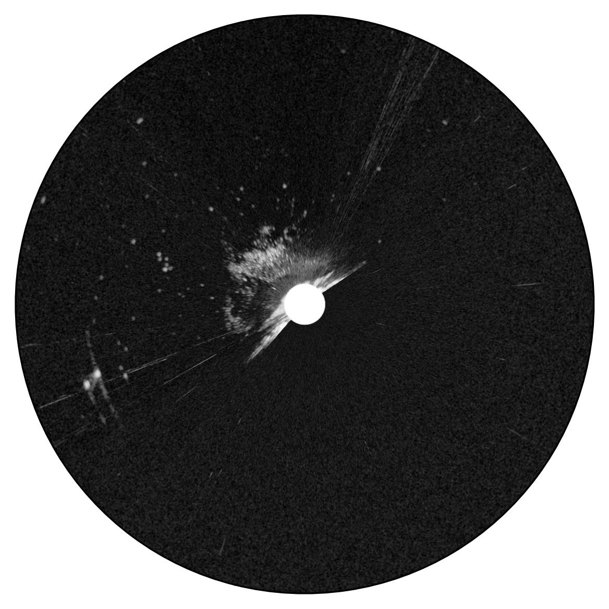
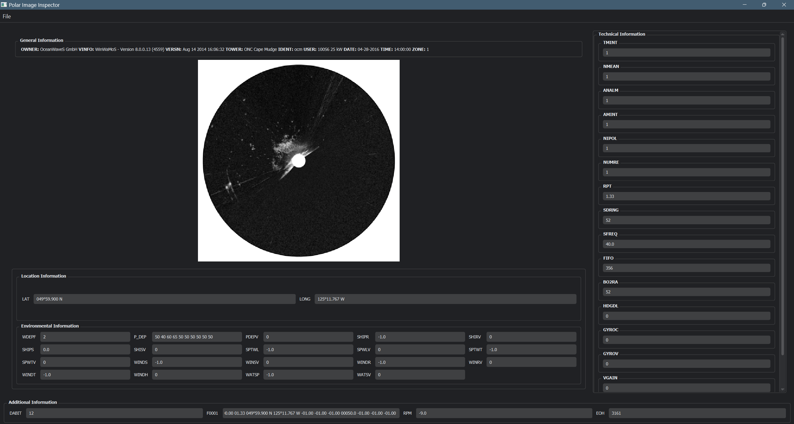

# Polar-Image-Inspector
This is a byproduct of my Master's Capstone project. This application allows you to import any Polar Radar Image (*.pol file) and view its metadata and render a cartesian image from the byte data. 

This project is designed to work for both 8-bit and 16-bit data type. Do note that it has not been tested on 8-bit data. Refer to [Wamos II Manual](https://www.yumpu.com/en/document/read/49205057/wamos-ii-manual) for the exact details.

---
> [!IMPORTANT]
> I cannot provide sample Polar Images due to copyright issues. However you can still test the Software on the png i provided (with metadata).
---

# Requirements
1. Python v3.7 to v3.10


# Installation

- Clone the repo
```bash
git clone https://github.com/deepratnaawale/Polar-Image-Inspector.git
```

- Goto the Downloaded repo
  
```bash
cd Polar-Image-Inspector
```

- Make virtual enviorenment using pip `(recommended)`
```bash
python -m venv .venv
```

- Activate Virtual Enviorenment
  
  - For Windows
  ```bash
  .venv\Scripts\activate.bat
  ```
  
  - For Linux/ MacOS
  ```bash
  .venv\Scripts\activate.sh
  ```

- Install Requirements
```bash
pip install -r requirements.txt
```

- Launch GUI
```bash
python PolarImageInspector.py
```

# Standalone Polar Image Parser

The [Polar Image Parser](Wamos2/polar_image.py) can be used independently using the following code.

```python
# Provided you copied the Wamos2 Directory into your code

from Wamos2.polar_image import PolarImage

polarImage = PolarImage('path/to/polar_image.pol')
polarImage.render(orient = True, toggle_direction = True)

# All header attributes can be accesed as follows
# polarImage.get('Atribute'), the header stores attribute keys in upper case like the metadata in POL files, however you do not need to capitalize the attribute when passing to .get() function
dabit = polarImage.get('DABIT')

# You can also use describe to understand what a specific Attribute is (this information is directly taken from the Header of POL files)
polarImage.describe('DABIT')

#The header stores information in a dict as follows ;
'attribute': {
  'value': 'some_value', 
  'description': 'Description of Attribute.'
}

```

# Saving the image
> [!TIP]
> You can save the image with the metadata using polarImage.save_with_metadata()

The default image extension is `.png`

> [!NOTE]
> The default output path is 'Output/input_image_name.png'


---

# Example Image Extracted


---

# GUI Preview (Supports Dark Mode now!)


---

# Wave Height Analysis
My Master's Capstone Project was on predicting Wave Heights of Ocean Waves and can be explored via the [Jupyter Notebook](WaveHeightAnalysis.ipynb). The project uses a Hybrid Neural Network with CNN for images and MLP for numerical data to predict wave height. The detailed analysis and model construction can be observed in the [Jupyter Notebook](WaveHeightAnalysis.ipynb).


> [!NOTE]
> You'll need to use inline python commands for any libraries you might have to install in the Notebook.

# References
- [Wamos II Manual](https://www.yumpu.com/en/document/read/49205057/wamos-ii-manual)